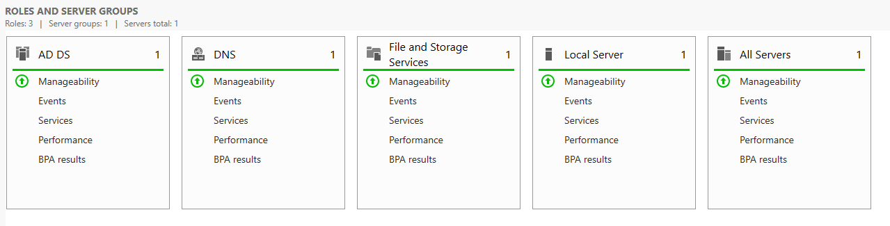
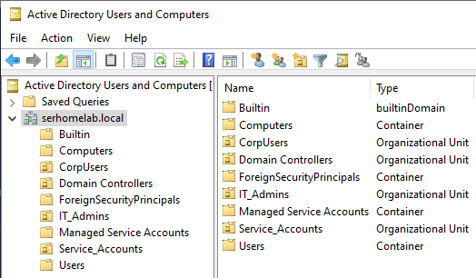
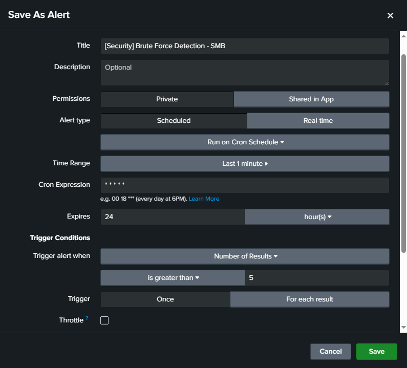

# SMB Brute Force Detection Lab
### Active Directory Attack Simulation & Splunk Detection Engineering


## 📖 Executive Summary
This project involves the design and deployment of a vulnerable Active Directory (AD) Home Lab to simulate an identity-based attack (SMB Brute Force/Password Spraying). The objective was to ingest endpoint telemetry into a SIEM (Splunk), analyze authentication failure logs, and engineer a custom detection rule to trigger alerts in real-time.

This lab demonstrates proficiency in **Blue Team operations**, specifically:
- Network segmentation and AD administration.
- Log ingestion pipeline configuration (Universal Forwarder, Sysmon).
- Adversary simulation using Kali Linux.
- Writing SPL (Splunk Processing Language) for threat detection.

---

## 🏗️ Lab Architecture & Specifications

The environment was hosted on a Type 2 Hypervisor (VirtualBox) with a dedicated NAT Network (`10.0.10.0/24`) to simulate an isolated corporate LAN.

### Host Machine
* **Processor:** AMD Ryzen 9 5900HX (3.30 GHz)
* **RAM:** 32 GB
* **OS:** Windows 11 Pro

### Virtual Machines
| Role | OS | Resources | Function |
| :--- | :--- | :--- | :--- |
| **Domain Controller** | Windows Server 2022 | 4 vCPU, 8 GB RAM | Identity Provider (AD DS), DNS, GPO Management |
| **Endpoint** | Windows 10 Pro | 2 vCPU, 4 GB RAM | Target user workstation joined to `serhomelab.local` |
| **Attacker** | Kali Linux (Rolling 2025.2) | 4 vCPU, 4 GB RAM | Command & Control (C2), Scanning, Exploitation |

> **Network Configuration:** The "HomeLab" NAT Network ensures strict isolation while allowing communication between the Attacker and the Target Domain.
>
> 

---

## 🛡️ Phase 1: Infrastructure & Telemetry Setup

### 1. Active Directory Deployment
Configured a new Forest `serhomelab.local`. Structured Organizational Units (OUs) to segregate `IT_Admins`, `CorpUsers`, and `Service_Accounts` for tiered administration simulation.
> 
> 

### 2. Telemetry Pipeline (Sysmon + Splunk)
Standard Windows logging is often insufficient for advanced threat hunting. I enhanced visibility by:
* Deploying **Sysmon** with the SwiftOnSecurity configuration to capture process creation (Event ID 1), network connections (Event ID 3), and file hashes.
* Configuring **Group Policy Objects (GPO)** to enable PowerShell Script Block Logging and Advanced Audit Policies.
* Installing **Splunk Universal Forwarder** on the Windows Endpoint to ship logs to the Splunk Indexer.

> 
> 
> 

---

## ⚔️ Phase 2: Attack Simulation

**Objective:** Attempt to compromise a user account via SMB Protocol without knowing the password.
**Tool:** `CrackMapExec` (Kali Linux)
**Technique:** Password Spraying / Brute Force (MITRE T1110.003)

I verified network connectivity between the Kali machine (`10.0.10.30`) and the Target (`10.0.10.20`).
> 

Executed the attack against the user `mrossi` using a custom wordlist:
```bash
crackmapexec smb 10.0.10.20 -u mrossi -p passlist.txt
```

The tool generated rapid authentication attempts, resulting in multiple `STATUS_LOGON_FAILURE` responses.

> 

---

## 🔍 Phase 3: Detection Engineering

### 1. Log Analysis
Navigating to the Splunk Search Head, I queried `index=main` specifically looking for Windows Event ID **4625** (An account failed to log on). The logs clearly showed a spike in failures originating from the attacker's IP.

**SPL Query Used:**
```splunk
index=main EventCode=4625
| stats count by Account_Name, Source_Network_Address, Workstation_Name
```

> 

### 2. Alert Logic Creation
Than I queried `index=main` for Windows Event ID **4625** and to automate detection, I created a **Threshold-Based Alert** to filter out occasional user errors while capturing sustained attacks.

* **Trigger Condition:** `Number of Results > 5` (within a 1-minute window).
* **Cron Schedule:** Runs every minute (`* * * * *`).
* **Severity:** High.
* **Action:** Log to the "Triggered Alerts" dashboard (Simulating a SOC Ticket creation).

> 

### 3. Validation
To validate the engineering process, I re-executed the `crackmapexec` attack from the Kali machine. The detection logic successfully caught the anomaly in real-time, populating the SOC dashboard with the alert.

> 

---

## 🗺️ MITRE ATT&CK Mapping

| Tactic | ID | Technique | Procedure |
| :--- | :--- | :--- | :--- |
| **Credential Access** | T1110.003 | Password Spraying | Attempting a list of passwords against the `mrossi` account via SMB. |
| **Discovery** | T1087.002 | Account Discovery: Domain Account | Enumerating domain users to identify valid targets. |
| **Lateral Movement** | T1021.002 | SMB/Windows Admin Shares | Using valid credentials to access the target system via port 445. |

---

## 🚀 Key Takeaways
* **Visibility is Key:** Without enabling **Advanced Audit Policies** (specifically Logon/Logoff events) and **Sysmon**, the granularity needed to identify the source IP and the specific account target would be missing.
* **Threshold Tuning:** Setting the alert threshold is a critical balance.
    * *Too Low:* High False Positive rate (e.g., a user mistyping a password twice).
    * *Too High:* Risk of missing "Low and Slow" attacks.
* **Protocol Vulnerabilities:** SMB (Port 445) remains a primary vector for enumeration and lateral movement. Monitoring authentication failures on this protocol is mandatory for internal security posture.
